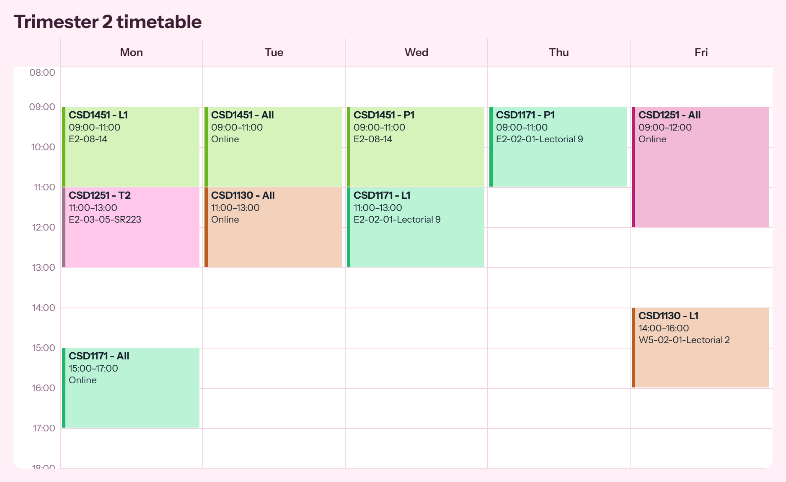
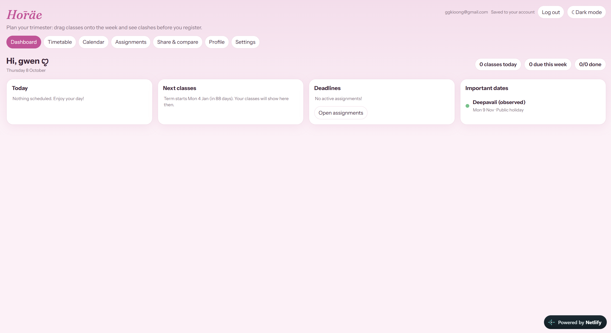

# Hōräe

**Plan your trimester, spot class clashes before you register, and keep your timetable on every device.**

Hōräe is a student planning web app. Build a weekly timetable by dragging classes onto a grid, see clashes instantly, track assignment deadlines, view everything in a calendar, and share your timetable with friends to find common free time.

## Features

- **Timetable maker:** drag and drop classes onto a weekly grid, with automatic clash detection (overlaps turn red and sit side by side).
  - A class bank holds classes not yet on your timetable, with multi-select delete.
  - Choose custom colours per class or per module.
  - Show or hide Sat/Sun and set the hours you want to see.
  - Download the timetable as a PNG or as a phone wallpaper (iPhone and Android sizes).
- **Dashboard:** today's schedule, next classes, nearest deadlines with live countdowns, and upcoming holidays and events.
- **Calendar:** month, week and day views showing classes, assignment deadlines, public holidays (Singapore, per MOM) and your own events.
  - Classes repeat weekly within the term and follow week numbers in their notes (e.g. `Wk1-6,8-13`).
- **Assignment tracker:** module, title, due date and time, a live "time left" countdown, and a status of Not started, In progress or Completed.
- **Sharing:**
  - Share a read-only timetable via a link.
  - Download a timetable image.
  - Add friends' links to see a **common free time** grid.
- **Profile:** personal info, modules overview, saved timetable copies (e.g. "Plan A / Plan B"), password change and JSON data export.
- **Settings:**
  - Week start day (Mon/Sun/Sat), 12/24-hour time, and date format.
  - Start page and default calendar view, plus which layers show on the calendar.
  - Browser reminders for deadlines and classes.
- **Accounts:** register and log in; your data syncs across devices.
- **Light and dark mode.**

## How it works

- **Data:** each user has one row in `timetables` containing a JSON document with their classes, settings, assignments, events and saved timetable copies. It is also cached in `localStorage`. The app saves automatically a moment after each change.
- **Sharing:** a share link stores your classes (day, time, notes, colour) in the URL hash. It does not include your email, assignments or events, and nothing is sent to a server. Friends you add for comparison are stored on that device only.
- **Term dates:** the default term is 14 weeks starting Monday 4 Jan 2027. Change it in **Calendar → Add an event · term dates**.
- **Public holidays:** these are Singapore's, from the Ministry of Manpower (2027, plus Deepavali and Christmas 2026). They live in the `HOL` object in `index.html`; edit it to add other years or countries.
- **Pre-loaded classes:** the class bank starts with a sample Trimester 2 module list. Delete these with **Select all → Delete selected**, or edit the `SEED` constant in `index.html`.

## Notifications

Reminders use the browser Notification API, so they appear **only while Hōräe is open in a browser tab**. They do not fire when the page is closed. Email or push reminders would need a server-side job (for example a Supabase Edge Function on a schedule).

## Privacy

- Passwords are handled by Supabase Auth. They are never stored by this app.
- Timetable data is protected by Row Level Security.
- Share links contain only the timetable, never account details.

## Limitations and ideas

- The week and day calendar views are lists per day rather than hour-by-hour grids.
- Only one timetable is live at a time (saved copies can be loaded in).
- Holidays are Singapore-only for now.
- Ideas: email/push reminders, hour-by-hour calendar view, importing a timetable, more holiday calendars.
